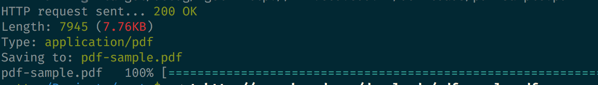

## rget
--

[](https://travis-ci.org/mattgathu/rget)
[](https://ci.appveyor.com/project/mattgathu/rget)

A wget clone written in Rust.

## features

* support for *http* and *https* downloads
* support for *ftp* downloads
* Download *resume* capability
* download *progress bar*

## usage

```
Rget 0.1.0
Matt Gathu <mattgathu@gmail.com>
wget clone written in Rust

USAGE:
    rget [FLAGS] [OPTIONS] <URL>

FLAGS:
    -c, --continue    resume getting a partially-downloaded file
    -h, --help        Prints help information
    -q, --quiet       quiet (no output)
    -V, --version     Prints version information

OPTIONS:
    -O, --output-document <FILE>    write documents to FILE

ARGS:
    <URL>    url to download

```

## screenshot



## license

This project is license used the MIT license. See [LICENSE](LICENSE) for more details.
